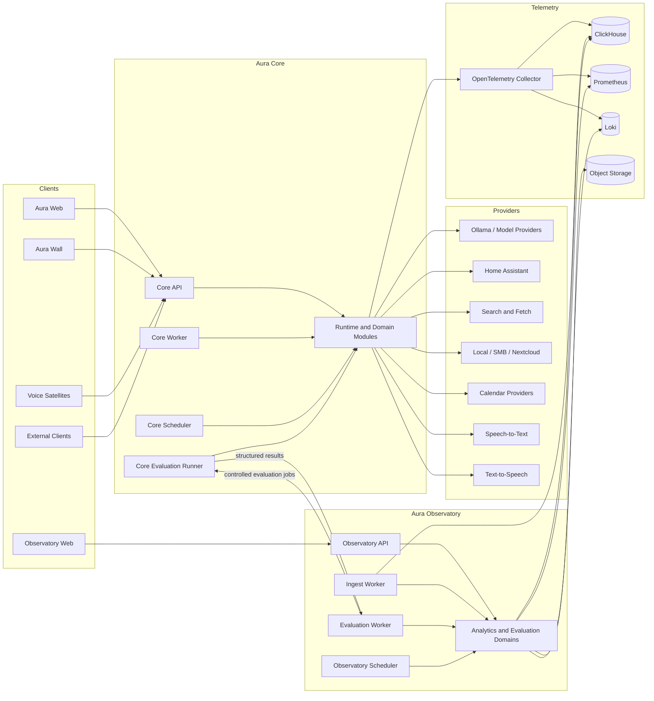

# Aura AI — Architecture and Repository Handover

## 1. Purpose and scope

This document captures the current architectural direction for **Aura AI** and the separate **Aura Observatory** service. It consolidates the design decisions established through the project discussions into one handover suitable for Codex and future contributors.

It defines:

- The product and system boundaries.
- The core concepts used throughout the codebase.
- The logical architecture of Aura Core.
- The separate monitoring and evaluation architecture of Aura Observatory.
- The expected dependency and ownership rules.
- The frontend, satellite, contracts, SDK, deployment, and infrastructure structure.
- The complete target monorepo topology.
- The decisions that remain intentionally unresolved.

This document intentionally does **not** define implementation order, phases, milestones, priorities, or recommended next steps. The repository tree is a target placement map, not an instruction to create every directory or file immediately.

## 2. Product definition

**Aura AI** is a local-first, extensible, house-wide personal AI platform. It is intended to provide a shared intelligence layer across:

- Text and voice conversations.
- Multiple independently configured agents and personalities.
- Long-term personal memory.
- Local documents and large filesystem-backed knowledge collections.
- Web research.
- Home Assistant.
- Timers, reminders, schedules, workflows, and notifications.
- Calendars and personal services.
- Generated artifacts.
- Future room-aware, visual, and proactive capabilities.

Aura is the platform identity. A possible expansion is **Adaptive Unified Reasoning Architecture**, but the acronym is optional and must not constrain the product.

Aura is not one fixed chatbot personality. It supports multiple agents and personas over shared platform engines, contracts, security controls, infrastructure, and selected memory scopes.

**Aura Observatory** is a separate product and service dedicated to operational monitoring, trace analysis, module-level evaluation, experiment tracking, regression detection, and performance attribution. It must be able to explain not only that overall answer quality changed, but which component changed, how it changed, and which code, model, prompt, policy, deployment, or dependency version correlates with that change.

## 3. Architectural baseline

The following principles are part of the current architecture baseline.

### 3.1 Local-first operation

Private conversations, memory, document processing, voice processing, home control, and core inference should run locally whenever practical.

Optional cloud providers may be supported through explicit adapters and policies. They must not become invisible or mandatory dependencies. Cloud access must be separately configured, permissioned, auditable, and easy to disable.

### 3.2 Shared engines, independently configured agents

Agents are persistent identities and versioned configurations built on shared implementations.

An agent may have its own:

- Purpose.
- Persona.
- prompt configuration.
- model policy.
- tool grants.
- memory visibility and write policy.
- execution limits.
- workspace.
- private state.

An agent must not require a separate implementation of orchestration, memory retrieval, tool execution, prompt compilation, model routing, policy enforcement, or persistence.

### 3.3 Domain-oriented modularity

Aura Core is a **modular monolith** with strong internal boundaries and multiple deployable entrypoints.

The codebase is organized primarily by cohesive domain and capability, not by global technical folders such as:

```text
models/
services/
repositories/
controllers/
schemas/
utils/
```

Technical layers may exist inside a domain module when they provide real separation. They must not become repository-wide dumping grounds.

### 3.4 One use case, multiple entrypoints

HTTP routes, model-facing tools, voice intents, scheduled jobs, workers, CLI commands, and internal workflows must invoke the same application use cases.

For example:

```text
HTTP endpoint
Model-facing tool
Voice intent
Scheduled workflow
        │
        ▼
CreateReminder command and handler
        │
        ├── validates the request
        ├── applies reminder domain rules
        ├── persists the reminder
        └── emits ReminderCreated
```

The entrypoint translates input. It does not reimplement reminder logic.

### 3.5 Deterministic systems for deterministic responsibilities

Timers, reminders, schedules, authentication, permissions, confirmations, state transitions, persistence, and other critical functions must be implemented as deterministic services and domain logic.

Language models interpret intent, plan, select tools, synthesize responses, and assist with ambiguous work. They do not replace reliable infrastructure.

### 3.6 Provider-agnostic core

Ollama is the current inference provider, Home Assistant is the current home-automation authority, and several local voice and search components are envisioned. Core domain and runtime code must depend on narrow internal ports rather than provider-specific APIs.

### 3.7 Explicit ownership and boundaries

Every domain owns its rules, writes, persistence mappings, and migrations. Other domains interact through public application contracts, queries, commands, DTOs, or events.

One module must not reach into another module's ORM tables or adapter internals.

### 3.8 Inspectability and correction

The user must be able to inspect and correct:

- Stored memories.
- Agent configurations.
- Personas.
- Tool permissions.
- Confirmations.
- Automations.
- Evaluation datasets and baselines.
- Captured telemetry where privacy policy permits it.

Important actions must be traceable without exposing hidden model reasoning.

### 3.9 Bounded execution

Agent runs, delegated tasks, retries, tool calls, and model usage require explicit limits, cancellation, deadlines, idempotency rules, and auditable outcomes.

### 3.10 Observatory independence

Aura Observatory is not an admin page embedded inside Aura Core. It has its own:

- Backend service.
- Web application.
- database.
- workers.
- scheduler.
- authentication and authorization boundary.
- migrations.
- retention policy.
- deployment lifecycle.

Observatory must not read Aura Core's database directly.

## 4. Core terminology

The following terms must remain distinct.

### 4.1 Platform

The complete Aura system, including shared runtime engines, domains, integrations, clients, and infrastructure.

### 4.2 Agent profile

A persistent agent identity. It owns stable identity-level information such as its name, purpose, private agent memory scope, and revision history.

### 4.3 Agent revision

An immutable version of an agent's effective configuration, including:

- Persona reference.
- prompt bundle reference.
- model policy reference.
- tool policy reference.
- memory policy reference.
- execution policy reference.
- workspace reference.
- configuration metadata.

Every run records the exact agent revision it used.

### 4.4 Persona

A reusable expression and interaction profile. It may define tone, vocabulary, verbosity, voice, initiative, conversational style, and behavioural instructions.

A persona must not silently override platform security, change factual truth, or widen access.

### 4.5 Conversation

An ordered user-facing thread of messages associated with an agent. One agent may have many conversations.

### 4.6 Run

One execution initiated by a message, event, scheduled trigger, API request, another agent, or an evaluation job.

A run records its context, agent revision, model choices, tool activity, component spans, result, status, and parent relationship.

### 4.7 Task

Durable work that may outlive the initiating request. Examples include indexing a directory, monitoring a condition, performing extended research, waiting for a schedule, or running a multi-step workflow.

### 4.8 Workspace

A bounded project or activity context that may carry dedicated memories, documents, tools, policies, and artifacts.

### 4.9 Memory scope

An ownership and visibility boundary for durable memory. The expected hierarchy is:

```text
platform
household
user
workspace
agent
conversation
task
run
```

A memory policy defines which scopes an agent may read and where it may write.

### 4.10 Artifact

A generated or uploaded file-like result such as a report, code patch, image, export, attachment, plan, dataset, or evaluation output.

### 4.11 Tool

A typed model-facing capability contract. A tool exposes what a model may request, but it does not own the underlying application logic.

### 4.12 Port

A narrow interface defined by the core that describes a required external capability.

### 4.13 Provider or adapter

A concrete implementation of a port, such as Ollama, Home Assistant, SearXNG, CalDAV, an SMB filesystem, or an S3-compatible object store.

### 4.14 Observable component

A versioned, instrumented unit of execution with a stable component identifier, typed input and output contract, operational metrics, quality evaluators, and optional replay support.

## 5. System context and service topology

The monorepo contains two major backend products plus several clients and shared packages.



### 5.1 Aura Core deployables

Aura Core consists of multiple thin processes over one shared Python application:

- **Core API** — HTTP, realtime streaming, authentication entrypoints, and client-facing operations.
- **Core Worker** — durable background execution such as agent runs, indexing, memory processing, workflows, and outbox delivery.
- **Core Scheduler** — dispatches due reminders, schedules, maintenance jobs, and other time-based commands.
- **Core Evaluation Runner** — executes controlled component replays and end-to-end evaluations against the exact deployed Core code.
- **Core CLI** — database, diagnostics, configuration, indexing, and administrative commands.

These processes share domain and application logic. They exist for deployment, concurrency, isolation, and resource control, not to host separate implementations.

### 5.2 Aura Observatory deployables

Aura Observatory consists of:

- **Observatory API** — dashboards, trace queries, component health, datasets, experiments, baselines, alerts, incidents, and administration.
- **Ingest Worker** — consumes telemetry, structured run events, deployment events, and evaluation results.
- **Evaluation Worker** — coordinates evaluation jobs, scoring, comparisons, calibration, and regression analysis.
- **Observatory Scheduler** — metric rollups, scheduled evaluations, alert evaluation, retention, and health snapshots.
- **Observatory CLI** — dataset, evaluation, baseline, telemetry, and diagnostic operations.
- **Observatory Web** — the dedicated operational and evaluation interface.

### 5.3 Client applications

- **Aura Web** — primary responsive PWA for conversation, agent configuration, memory, knowledge, automations, integrations, approvals, artifacts, and system controls.
- **Aura Wall** — restricted kiosk-style client for room-aware interaction, voice, timers, reminders, notifications, and selected home state.
- **Voice Satellite** — deployable thin client for wake word, microphone capture, voice activity detection, streaming, playback, room identity, and diagnostics.
- **Observatory Web** — separate application for monitoring and evaluation.

## 6. Aura Core logical architecture

Aura Core is divided into four broad internal areas.

### 6.1 Runtime engines

Shared agent execution machinery:

- Run coordination.
- context assembly.
- prompt compilation.
- model routing and capacity management.
- tool registration and execution.
- delegation.
- streaming.
- replay.
- diagnostics and instrumentation.

Runtime code coordinates domain capabilities. It must not absorb every domain's business rules.

### 6.2 Domain modules

Persistent business concepts and rules:

- Interaction.
- execution.
- knowledge.
- automation.
- governance.
- integrations.
- artifacts.

Each domain exposes a deliberate public API.

### 6.3 Platform services

Generic technical mechanisms:

- Database sessions and transactions.
- event dispatch.
- transactional outbox.
- queues.
- job infrastructure.
- scheduling primitives.
- distributed locks.
- caching.
- object storage.
- secrets.
- serialization.
- telemetry.

Platform code must remain generic and must not become an alternative home for domain logic.

### 6.4 Providers

Concrete external integrations implementing core ports:

- Model providers.
- embedding providers.
- rerankers.
- home automation.
- search.
- calendars.
- knowledge sources.
- voice.
- notifications.
- object storage.

Only the composition root should know which concrete provider is bound to a port.

## 7. Agent and run architecture

### 7.1 Agent composition

An effective agent is assembled from independently versioned policies and references:

```text
AgentProfile
└── AgentRevision
    ├── purpose and behavioural instructions
    ├── PersonaRevision
    ├── PromptBundleRevision
    ├── ModelPolicyRevision
    ├── ToolPolicyRevision
    ├── MemoryPolicyRevision
    ├── ExecutionPolicyRevision
    └── optional Workspace
```

Agents are data and policy compositions, not separate Python applications.

### 7.2 Run context

Every run receives an explicit context object rather than relying on mutable global state.

Conceptually:

```python
RunContext(
    principal_id=...,
    household_id=...,
    workspace_id=...,
    agent_profile_id=...,
    agent_revision_id=...,
    conversation_id=...,
    run_id=...,
    parent_run_id=...,
    task_id=...,
    channel=...,
    device_id=...,
    room_id=...,
    memory_scopes=...,
    tool_grants=...,
    model_policy=...,
    execution_budget=...,
    deadline=...,
    trace_id=...,
)
```

The context should be immutable for the lifetime of the run. New state is recorded through explicit events, commands, and persistence.

### 7.3 Parallel execution

The platform must support multiple concurrent conversations and agents.

The intended concurrency rules are:

- Independent conversations may run concurrently.
- Different agents may run concurrently subject to resource limits.
- Mutating runs within one conversation are ordered by default.
- Explicit conversation branches may execute independently.
- Independent read-only tool calls may execute concurrently.
- Mutating tool calls require serialization, resource locks, or idempotency controls.
- Parent and child runs retain explicit lineage.
- Cancellation propagates according to the execution policy.

### 7.4 Delegation

An agent may create bounded child runs for specialist agents.

A delegated child receives:

- A precise objective.
- explicitly selected context.
- restricted memory scopes.
- restricted tool grants.
- token, time, and step budgets.
- a parent run identifier.
- an expected result contract.

Delegation may narrow permissions but must never silently widen them.

Child results should return as structured task results or artifacts rather than automatically injecting complete transcripts into the parent context.

### 7.5 Model scheduling

Agents select model policies rather than GPUs or concrete provider instances.

A model request may describe:

```yaml
required_capabilities:
  - tool_calling
  - structured_output
preferred_class: general
fallback_class: fast
max_context_tokens: 32000
priority: interactive
```

The model gateway and capacity scheduler map that policy to an available provider, model, quantization, host, and GPU.

The current dual-GPU environment is asymmetric. The architecture must not assume that 12 GB and 8 GB of VRAM behave as a single seamless 20 GB pool.

### 7.6 Prompt composition

Prompts are compiled from versioned components rather than stored as one large string inside an agent class.

Expected composition:

```text
Platform rules
+ governance and policy instructions
+ agent purpose
+ persona
+ current user, device, room, and channel context
+ conversation summary
+ selected memories
+ selected documents
+ available tool contracts
+ current task
+ output contract
```

The effective component versions and prompt hash must be traceable for evaluation and debugging.

## 8. Memory and knowledge architecture

### 8.1 Separate information types

The architecture must distinguish:

- Conversation messages.
- working context assembled for a run.
- agent state.
- long-term memory.
- source documents.
- generated artifacts.
- evaluation fixtures.
- run checkpoints.

A vector index is an index over records. It is not the primary source of truth for all information.

### 8.2 Memory categories

The envisioned memory model includes:

- **Working memory** — short-lived run or task context.
- **Episodic memory** — time-bound events and interactions.
- **Semantic memory** — durable facts and relationships.
- **Procedural memory** — instructions, methods, and recurring workflows.
- **Preference memory** — user-specific choices and interaction preferences.
- **System memory** — devices, services, rooms, integrations, and infrastructure facts.

### 8.3 Scoped memory

A memory record carries an ownership and visibility scope. Agent memory policy controls:

- Which scopes may be read.
- Which scopes may be searched by default.
- Which scope receives ordinary writes.
- Which broader writes require confirmation.
- Which scopes are excluded.
- Which sensitivity classes may be returned to a given channel or device.

Example:

```yaml
agent: development-assistant

memory:
  read:
    - user
    - workspace:homelab
    - workspace:aura-ai
    - agent:development-assistant
    - current-conversation
  write_default:
    - agent:development-assistant
  may_propose_writes:
    - user
    - workspace:aura-ai
```

### 8.4 Temporal truth and provenance

Durable memory should support:

- Source and provenance.
- observed timestamp.
- created timestamp.
- valid-from and valid-to timestamps.
- confidence.
- importance.
- sensitivity.
- access scope.
- current status.
- dispute state.
- supersession links.
- reinforcement history.
- related entities.

Historical truth must remain queryable without presenting stale information as current.

### 8.5 Memory lifecycle

The expected lifecycle is:

```text
Observation or conversation
  -> memory candidate extraction
  -> classification
  -> sensitivity and permission check
  -> deduplication and entity resolution
  -> create, reinforce, merge, dispute, or supersede
  -> later retrieval
  -> user inspection, correction, or deletion
```

### 8.6 World model

The world model represents inspectable entities and relationships such as:

- People.
- projects.
- devices.
- rooms.
- services.
- locations.
- preferences.
- decisions.
- procedures.
- problems.
- attempted fixes.
- outcomes.
- historical events.

It should complement, not replace, source-backed memories and documents.

### 8.7 Large local file retrieval

Aura should not pre-embed every byte of large local and SMB-backed storage.

The intended strategy is hierarchical and on-demand.

#### Catalogue layer

Periodically index lightweight metadata:

- Path and filename.
- parent directories.
- file extension and media type.
- size.
- creation and modification time.
- tags.
- access scope.
- content hash where practical.
- source connection and availability.
- directory hierarchy.

The catalogue supports exact, lexical, faceted, and path-aware search.

#### Lightweight semantic metadata

Selected files may receive inexpensive derived metadata:

- Title.
- short summary.
- keywords.
- named entities.
- project or topic classification.
- a compact embedding of metadata or summary.

#### On-demand inspection

When a query points to a likely file:

1. Search catalogue metadata and directory context.
2. identify plausible candidates.
3. apply access and sensitivity policy.
4. request confirmation when ambiguity, privacy, cost, or file size requires it.
5. parse the selected content.
6. chunk and embed relevant content temporarily or in a cache.
7. rerank the evidence.
8. answer with provenance.
9. cache by content hash.
10. invalidate cached processing when the file changes.

Images follow the same disclosure model: inspect metadata and context before invoking vision processing.

## 9. Tool and integration architecture

A model-facing tool is not the integration implementation.

The required separation is:

```text
Tool contract
    What the model is allowed to request

Application use case
    What Aura actually does

Port
    What the application requires from an external system

Provider or adapter
    How a concrete system satisfies the port
```

Example:

```text
home.turn_on_light
    -> ExecuteHomeAction
    -> governance and confirmation checks
    -> HomeAutomationPort
    -> HomeAssistantAdapter
```

This keeps policy, validation, audit, idempotency, and business rules shared even when providers change.

Every tool definition should declare:

- Stable tool identifier and version.
- typed input schema.
- typed result schema.
- read-only or mutating classification.
- required permission scopes.
- confirmation policy.
- timeout.
- retry rules.
- idempotency expectations.
- audit fields.
- sensitivity classification.
- validation requirements.
- observable component identifier.

Home Assistant remains the authoritative system for devices, entities, rooms, scenes, and automations. Aura must not recreate the Home Assistant platform.

## 10. Frontend architecture

The frontend is an Angular workspace managed with Nx.

### 10.1 Application boundaries

- `aura-web` may import Aura feature libraries, shared frontend libraries, and the Aura API client.
- `aura-wall` may import selected Aura feature libraries, shared frontend libraries, and the Aura API client.
- `observatory-web` may import Observatory feature libraries, shared frontend libraries, and the Observatory API client.
- Frontend applications must not import from one another.
- Observatory feature code must not import Aura feature implementations.
- Shared libraries must remain generic.

### 10.2 Domain libraries

Feature logic lives in domain libraries rather than application shells.

An Aura conversation library may contain:

```text
pages/
components/
data-access/
state/
models/
routes.ts
```

The application shell primarily composes routes, navigation, layout, and global providers.

### 10.3 Generated API clients

OpenAPI contracts are the source for generated TypeScript and Python clients. Request and response types must not be manually recreated throughout the frontend.

### 10.4 Shared UI

Reusable visual primitives may be shared across Aura and Observatory, including:

- Design-system components.
- forms.
- layout primitives.
- charts.
- data grids.
- Markdown rendering.
- code viewing.
- icons.
- testing utilities.

Shared UI must not contain Aura agent, memory, or Observatory evaluation business logic.

## 11. Aura Observatory architecture

### 11.1 Purpose

Observatory is responsible for:

- Live operational status.
- run and trace inspection.
- component health.
- latency and throughput analysis.
- model and GPU performance.
- datasets.
- evaluation suites.
- experiments.
- baselines.
- regression detection.
- change correlation.
- component-level attribution.
- dashboards.
- alerts.
- incidents.
- annotations.
- privacy-aware captured artifacts.

### 11.2 Service boundary

Observatory owns:

- Evaluation definitions and datasets.
- experiment configuration.
- scoring.
- result storage.
- baselines.
- comparison logic.
- regression detection.
- dashboards and alerts.
- operational analytics.

Aura Core owns the production code being tested and the controlled evaluation runner that executes it.

Observatory submits an evaluation request to Core. Core executes the exact deployed component or end-to-end path and returns a structured result.

Observatory must not import Core's private modules or query Core's database.

### 11.3 Telemetry flow

Aura Core emits:

- OpenTelemetry-compatible traces.
- metrics.
- structured logs.
- run events.
- component observations.
- deployment metadata.
- evaluation results.
- selected redacted artifacts.

The OpenTelemetry Collector provides buffering and routing.

Expected storage roles:

| Store | Ownership |
|---|---|
| Observatory PostgreSQL | Datasets, suites, experiments, dashboards, alert rules, baselines, component catalog, incidents |
| ClickHouse | High-cardinality spans, run observations, component measurements, evaluation observations, structured events |
| Prometheus | Host, process, container, database, queue, GPU, and service time-series metrics |
| Loki | Application and infrastructure logs |
| S3-compatible object storage | Captured artifacts, redacted inputs and outputs, large evaluation results |
| OpenTelemetry Collector | Telemetry ingestion, transformation, buffering, and routing |

Grafana may remain available for low-level infrastructure debugging. Observatory Web is the primary agent-specific analysis interface.

### 11.4 Observable component contract

Every meaningful runtime module should have a stable observable component identity.

Example:

```yaml
component:
  id: aura.knowledge.memory_retrieval
  version: git:74bd190
  category: retrieval

input:
  schema: memory-retrieval-input-v1
  replayable: true

output:
  schema: memory-retrieval-output-v1
  capture:
    content: redacted
    metadata: full

dependencies:
  - aura.knowledge.memory_store
  - aura.runtime.embedding_gateway

metrics:
  - latency_ms
  - candidate_count
  - returned_count
  - cache_hit
  - embedding_latency_ms
  - reranking_latency_ms

evaluators:
  - recall_at_k
  - precision_at_k
  - mean_reciprocal_rank
  - stale_result_rate
  - irrelevant_context_rate
```

The observability SDK should supply common instrumentation, semantic conventions, redaction, sampling, buffering, and exporters. A component declares meaningful measurements and replay hooks rather than reimplementing telemetry mechanics.

### 11.5 Standard trace shape

A normal run should resemble:

```text
agent.run
├── conversation.load
├── agent_revision.load
├── context.assemble
│   ├── memory.retrieve
│   ├── documents.discover
│   ├── documents.retrieve
│   └── context.rank
├── prompt.compile
├── model.route
├── model.infer
├── tool.plan
│   ├── policy.evaluate
│   └── tool.execute
├── response.synthesize
├── memory.extract
├── memory.persist
└── conversation.persist
```

Expected trace attributes include:

```text
run_id
trace_id
conversation_id
agent_id
agent_revision_id
component_id
component_version
deployment_id
model_id
model_policy_id
prompt_version
memory_policy_id
tool_policy_id
git_commit
host_id
gpu_id
```

### 11.6 Evaluation levels

Observatory supports three distinct forms of evaluation.

#### Passive production monitoring

Tracks normal production behaviour, including:

- Latency.
- error rates.
- queue time.
- throughput.
- token use.
- GPU and resource use.
- tool failures.
- user feedback.
- output distributions.
- component dependency health.

This is useful for correlation and operations.

#### Module replay evaluation

Executes saved or synthetic input against one component version in isolation.

Examples:

- Compare two memory retrieval versions.
- Compare two rerankers.
- compare tool-selection prompts.
- compare policy decisions.
- compare model routers.

This provides stronger component attribution.

#### End-to-end evaluation

Executes complete agent scenarios, including retrieval, model calls, tools, and final response scoring.

Observatory combines the three levels when presenting a likely cause of degradation.

### 11.7 Module metrics

Operational and quality metrics remain distinct.

| Component | Operational metrics | Quality metrics |
|---|---|---|
| Context assembly | Latency, selected tokens, truncation rate | Required-context inclusion, irrelevant-context rate |
| Memory retrieval | Search latency, rerank latency, candidate count | Recall@K, precision@K, MRR, stale-memory rate |
| Document retrieval | File-open latency, chunks read, embedding time | Relevant-document recall, citation support |
| Prompt compilation | Render latency, prompt size, failures | Missing sections, instruction conflicts |
| Model routing | Queue time, route latency, fallback rate | Correct model selection, unnecessary expensive routing |
| Model inference | Time to first token, tokens/sec, total latency, VRAM | Task score, structured-output validity, groundedness |
| Tool selection | Planning latency, selected tool count | Correct-tool rate, unnecessary-tool rate |
| Tool arguments | Validation failures, retries | Field accuracy, entity-resolution accuracy |
| Tool execution | Execution latency, timeout rate, error rate | Task completion, side-effect correctness |
| Policy engine | Decision latency, approval rate | False-positive and false-negative rates |
| Delegation | Child count, coordination overhead | Child-task success, result-merge quality |
| Response synthesis | Generation latency, output length | Correctness, usefulness, groundedness, feedback |

### 11.8 Privacy and capture policy

Observatory must not indiscriminately copy prompts, files, memories, calendar data, or tool results.

Supported capture levels:

```text
none
metadata_only
hashed
redacted
sampled_content
full_content
```

Capture policy is enforced by Aura Core before telemetry leaves the service boundary.

Full content belongs only in explicitly authorized evaluation datasets or similarly controlled contexts.

## 12. Data and storage ownership

### 12.1 Aura Core

Aura Core owns:

- Agent profiles and revisions.
- personas and revisions.
- conversations and messages.
- runs and run steps.
- tasks and checkpoints.
- memories and world-model entities.
- document catalog and processing metadata.
- reminders, schedules, workflows, and triggers.
- integrations and connections.
- permissions and approvals.
- audit records.
- artifacts and their metadata.
- transactional outbox state.

PostgreSQL is the primary source of truth. `pgvector` is the current baseline for vector indexing where it is sufficient. Dedicated vector infrastructure remains replaceable behind ports.

Object content may live in local or S3-compatible storage while Core retains ownership metadata.

### 12.2 Aura Observatory

Observatory owns:

- Component catalog.
- deployment catalog.
- telemetry metadata.
- datasets.
- evaluation suites.
- experiments.
- results.
- baselines.
- regressions.
- dashboards.
- alert rules.
- incidents.
- annotations.
- retention configuration.

Observatory stores high-volume telemetry separately from transactional metadata.

### 12.3 Prohibited coupling

- Observatory must not read or write Core database tables.
- Core must not query Observatory's database to complete normal user requests.
- Shared database schemas are prohibited.
- Cross-service communication uses versioned contracts, generated clients, event schemas, OTLP, and controlled job channels.
- A service owns its own migrations.

## 13. Events, messaging, and consistency

Aura Core should use direct application calls for ordinary synchronous operations and events for decoupled reactions.

Example:

```text
Create reminder
    -> direct command handler
    -> transaction commits
    -> ReminderCreated written to transactional outbox
    -> asynchronous consumers schedule delivery and update projections
```

The architecture uses:

- In-process domain events where immediate coordination is appropriate.
- A transactional outbox for durable publication.
- At-least-once delivery assumptions for asynchronous processing.
- Idempotent consumers.
- Stable event identifiers and schema versions.
- Explicit correlation and causation identifiers.

The system is event-enabled, not fully event-sourced.

## 14. Contracts and shared SDKs

Shared code is limited to intentional cross-service contracts and reusable platform SDKs.

### 14.1 Aura contracts

Contains versioned Python representations of:

- Events.
- component manifests.
- telemetry payloads.
- evaluation requests and results.
- shared identifiers.
- API-compatible DTOs where appropriate.

It must not contain private domain logic from either service.

### 14.2 Observability SDK

Provides:

- Instrumentation helpers.
- component decorators and context.
- semantic conventions.
- metrics and tracing.
- structured events.
- sampling.
- redaction.
- buffering.
- exporters.

### 14.3 Evaluation SDK

Provides:

- Component evaluation contracts.
- replay contracts.
- test-case models.
- score models.
- evaluator interfaces.
- fixtures.
- snapshots.
- probes.

### 14.4 Generated clients

- Aura Python client.
- Observatory Python client.
- Aura TypeScript client.
- Observatory TypeScript client.

Generated clients follow the OpenAPI contracts and should not embed business logic.

### 14.5 Extension SDK

Defines supported extension points for:

- Tool providers.
- model providers.
- knowledge sources.
- notification providers.
- observable components.
- provider configuration.
- health checks.

## 15. Dependency and module rules

These rules should be documented and enforced with architecture tests.

1. `kernel` remains small and stable. It contains identifiers, clocks, base errors, result primitives, event primitives, pagination, concurrency primitives, and similarly universal types.
2. Domain modules own their data, rules, writes, mappings, and migrations.
3. Cross-domain imports go through documented public APIs.
4. A domain may not import another domain's adapters, ORM tables, or internal handlers.
5. Entrypoints remain thin.
6. Runtime engines coordinate capabilities but do not duplicate domain rules.
7. Providers implement inward-facing ports and must not orchestrate agents.
8. Only bootstrap and composition code know concrete implementations.
9. Shared packages contain genuine cross-product contracts or SDK machinery, not miscellaneous helpers.
10. Frontend applications contain composition, routing, layout, and shell concerns rather than domain feature implementations.
11. Frontend applications do not import from each other.
12. Observatory feature libraries do not import Aura feature libraries.
13. Generated API types are not manually duplicated.
14. Database ownership is explicit.
15. Workers and schedulers invoke shared application handlers rather than reimplementing operations.
16. Model-facing tools invoke shared application use cases.
17. Architecture tests reject forbidden import directions.
18. Instrumentation coverage tests verify that required observable components emit stable identifiers and required measurements.
19. User data, model weights, runtime databases, recordings, secrets, and private evaluation content are not committed to source control.
20. Folders such as `utils`, `helpers`, `managers`, and global `services` are not used as general dumping grounds.

## 16. Security and governance

Aura's governance model includes:

- User, household, device, room, and service identities.
- Scoped access to memories, workspaces, files, tools, and integrations.
- Read versus mutation classification.
- confirmation policies.
- approval workflows.
- idempotency.
- resource locks.
- audit events.
- sensitive-data classification.
- device and channel restrictions.
- revocable credentials.
- secret isolation.
- retention and deletion controls.

High-impact Home Assistant actions, filesystem mutations, credential use, external communication, and other consequential operations require explicit policy evaluation and, where configured, confirmation.

No model should receive unrestricted root, shell, Home Assistant administrator, or whole-filesystem access by default.

## 17. Reference deployment context

The current homelab context includes:

- Proxmox-based infrastructure.
- A dedicated Ubuntu AI virtual machine.
- AI VM address currently `192.168.0.40`.
- Ollama currently exposed locally on port `11434`.
- NVIDIA RTX 3080 with 12 GB VRAM.
- NVIDIA RTX 2080 with 8 GB VRAM.
- 32 GB system RAM on the AI node.
- Local Qwen-family general and coding models.
- Local embedding model support.
- TrueNAS storage and SMB shares.
- Home Assistant as the home-automation authority.
- Cloudflare and Nginx Proxy Manager in the broader homelab.
- Open WebUI as a useful test interface, not the intended final Aura experience.

All addresses, credentials, model names, provider endpoints, storage locations, and hardware assignments are configuration. They must not be scattered as constants throughout the codebase.

## 18. Full target repository tree

```text
aura-ai/
├── README.md
├── ARCHITECTURE.md
├── CONTRIBUTING.md
├── SECURITY.md
├── LICENSE
├── CODEOWNERS
├── .editorconfig
├── .gitignore
├── .env.example
├── .pre-commit-config.yaml
├── .python-version
├── pyproject.toml
├── uv.lock
├── justfile
├── compose.yaml
│
├── .github/
│   ├── workflows/
│   │   ├── core-ci.yml
│   │   ├── observatory-ci.yml
│   │   ├── frontend-ci.yml
│   │   ├── contracts-ci.yml
│   │   ├── architecture-tests.yml
│   │   ├── system-tests.yml
│   │   ├── evaluation-regression.yml
│   │   ├── performance-regression.yml
│   │   ├── build-images.yml
│   │   └── security-scan.yml
│   ├── ISSUE_TEMPLATE/
│   │   ├── bug.yml
│   │   ├── feature.yml
│   │   ├── evaluation-regression.yml
│   │   └── performance-regression.yml
│   └── pull_request_template.md
│
├── .devcontainer/
│   ├── devcontainer.json
│   ├── compose.yml
│   └── Dockerfile
│
├── services/
│   ├── aura-core/
│   │   ├── README.md
│   │   ├── pyproject.toml
│   │   ├── alembic.ini
│   │   │
│   │   ├── migrations/
│   │   │   ├── env.py
│   │   │   ├── script.py.mako
│   │   │   └── versions/
│   │   │
│   │   ├── resources/
│   │   │   ├── agents/
│   │   │   │   ├── general-assistant.yaml
│   │   │   │   ├── development-assistant.yaml
│   │   │   │   └── home-assistant.yaml
│   │   │   ├── personas/
│   │   │   │   ├── neutral.yaml
│   │   │   │   └── concise.yaml
│   │   │   ├── prompt-components/
│   │   │   │   ├── platform/
│   │   │   │   ├── governance/
│   │   │   │   ├── tools/
│   │   │   │   ├── memory/
│   │   │   │   └── output-contracts/
│   │   │   ├── policies/
│   │   │   │   ├── tool-access.yaml
│   │   │   │   ├── memory-access.yaml
│   │   │   │   ├── confirmation.yaml
│   │   │   │   ├── delegation.yaml
│   │   │   │   └── telemetry-capture.yaml
│   │   │   ├── model-policies/
│   │   │   │   ├── interactive.yaml
│   │   │   │   ├── background.yaml
│   │   │   │   ├── coding.yaml
│   │   │   │   └── evaluation.yaml
│   │   │   └── component-manifests/
│   │   │       ├── context-assembly.yaml
│   │   │       ├── memory-retrieval.yaml
│   │   │       ├── document-retrieval.yaml
│   │   │       ├── prompt-compilation.yaml
│   │   │       ├── model-routing.yaml
│   │   │       ├── model-inference.yaml
│   │   │       ├── tool-selection.yaml
│   │   │       ├── tool-execution.yaml
│   │   │       ├── policy-evaluation.yaml
│   │   │       ├── response-synthesis.yaml
│   │   │       └── delegation.yaml
│   │   │
│   │   ├── src/
│   │   │   └── aura_core/
│   │   │       ├── __init__.py
│   │   │       │
│   │   │       ├── bootstrap/
│   │   │       │   ├── application.py
│   │   │       │   ├── container.py
│   │   │       │   ├── settings.py
│   │   │       │   ├── logging.py
│   │   │       │   ├── telemetry.py
│   │   │       │   ├── lifecycle.py
│   │   │       │   └── health.py
│   │   │       │
│   │   │       ├── kernel/
│   │   │       │   ├── identifiers.py
│   │   │       │   ├── clock.py
│   │   │       │   ├── errors.py
│   │   │       │   ├── events.py
│   │   │       │   ├── result.py
│   │   │       │   ├── pagination.py
│   │   │       │   ├── concurrency.py
│   │   │       │   └── types.py
│   │   │       │
│   │   │       ├── runtime/
│   │   │       │   ├── coordinator/
│   │   │       │   │   ├── coordinator.py
│   │   │       │   │   ├── step_loop.py
│   │   │       │   │   ├── lifecycle.py
│   │   │       │   │   ├── cancellation.py
│   │   │       │   │   └── budgets.py
│   │   │       │   │
│   │   │       │   ├── context/
│   │   │       │   │   ├── builder.py
│   │   │       │   │   ├── selectors.py
│   │   │       │   │   ├── token_budget.py
│   │   │       │   │   └── snapshot.py
│   │   │       │   │
│   │   │       │   ├── prompting/
│   │   │       │   │   ├── compiler.py
│   │   │       │   │   ├── components.py
│   │   │       │   │   ├── renderer.py
│   │   │       │   │   └── versions.py
│   │   │       │   │
│   │   │       │   ├── models/
│   │   │       │   │   ├── gateway.py
│   │   │       │   │   ├── router.py
│   │   │       │   │   ├── capacity.py
│   │   │       │   │   ├── requests.py
│   │   │       │   │   ├── streaming.py
│   │   │       │   │   └── ports.py
│   │   │       │   │
│   │   │       │   ├── tools/
│   │   │       │   │   ├── registry.py
│   │   │       │   │   ├── executor.py
│   │   │       │   │   ├── validation.py
│   │   │       │   │   ├── results.py
│   │   │       │   │   └── ports.py
│   │   │       │   │
│   │   │       │   ├── delegation/
│   │   │       │   │   ├── dispatcher.py
│   │   │       │   │   ├── context_transfer.py
│   │   │       │   │   ├── limits.py
│   │   │       │   │   └── result_joining.py
│   │   │       │   │
│   │   │       │   ├── streaming/
│   │   │       │   │   ├── events.py
│   │   │       │   │   ├── publisher.py
│   │   │       │   │   └── subscriptions.py
│   │   │       │   │
│   │   │       │   ├── replay/
│   │   │       │   │   ├── component_runner.py
│   │   │       │   │   ├── snapshot_loader.py
│   │   │       │   │   ├── dependency_stubs.py
│   │   │       │   │   └── result_capture.py
│   │   │       │   │
│   │   │       │   └── diagnostics/
│   │   │       │       ├── component_registry.py
│   │   │       │       ├── instrumentation.py
│   │   │       │       ├── measurements.py
│   │   │       │       ├── capture_policy.py
│   │   │       │       └── health_snapshot.py
│   │   │       │
│   │   │       ├── domains/
│   │   │       │   ├── interaction/
│   │   │       │   │   ├── README.md
│   │   │       │   │   ├── agents/
│   │   │       │   │   ├── personas/
│   │   │       │   │   └── conversations/
│   │   │       │   │
│   │   │       │   ├── execution/
│   │   │       │   │   ├── README.md
│   │   │       │   │   ├── runs/
│   │   │       │   │   └── tasks/
│   │   │       │   │
│   │   │       │   ├── knowledge/
│   │   │       │   │   ├── README.md
│   │   │       │   │   ├── memory/
│   │   │       │   │   ├── catalog/
│   │   │       │   │   ├── documents/
│   │   │       │   │   ├── retrieval/
│   │   │       │   │   └── world_model/
│   │   │       │   │
│   │   │       │   ├── automation/
│   │   │       │   │   ├── README.md
│   │   │       │   │   ├── reminders/
│   │   │       │   │   ├── schedules/
│   │   │       │   │   ├── workflows/
│   │   │       │   │   ├── triggers/
│   │   │       │   │   └── notifications/
│   │   │       │   │
│   │   │       │   ├── governance/
│   │   │       │   │   ├── README.md
│   │   │       │   │   ├── identity/
│   │   │       │   │   ├── access/
│   │   │       │   │   ├── policy/
│   │   │       │   │   ├── approvals/
│   │   │       │   │   └── audit/
│   │   │       │   │
│   │   │       │   ├── integrations/
│   │   │       │   │   ├── README.md
│   │   │       │   │   ├── connections/
│   │   │       │   │   ├── capabilities/
│   │   │       │   │   └── health/
│   │   │       │   │
│   │   │       │   └── artifacts/
│   │   │       │       ├── README.md
│   │   │       │       ├── generated/
│   │   │       │       ├── attachments/
│   │   │       │       └── revisions/
│   │   │       │
│   │   │       ├── platform/
│   │   │       │   ├── database/
│   │   │       │   │   ├── engine.py
│   │   │       │   │   ├── session.py
│   │   │       │   │   ├── transaction.py
│   │   │       │   │   └── base.py
│   │   │       │   ├── events/
│   │   │       │   ├── outbox/
│   │   │       │   ├── queue/
│   │   │       │   ├── jobs/
│   │   │       │   ├── scheduling/
│   │   │       │   ├── locks/
│   │   │       │   ├── cache/
│   │   │       │   ├── object_store/
│   │   │       │   ├── secrets/
│   │   │       │   ├── serialization/
│   │   │       │   └── telemetry/
│   │   │       │
│   │   │       ├── providers/
│   │   │       │   ├── models/
│   │   │       │   │   └── ollama/
│   │   │       │   ├── embeddings/
│   │   │       │   │   ├── ollama/
│   │   │       │   │   └── sentence_transformers/
│   │   │       │   ├── rerankers/
│   │   │       │   │   └── cross_encoder/
│   │   │       │   ├── home_automation/
│   │   │       │   │   └── home_assistant/
│   │   │       │   ├── search/
│   │   │       │   │   └── searxng/
│   │   │       │   ├── calendars/
│   │   │       │   │   └── caldav/
│   │   │       │   ├── knowledge_sources/
│   │   │       │   │   ├── filesystem/
│   │   │       │   │   ├── smb/
│   │   │       │   │   └── nextcloud/
│   │   │       │   ├── voice/
│   │   │       │   │   ├── whisper/
│   │   │       │   │   └── piper/
│   │   │       │   ├── notifications/
│   │   │       │   │   ├── web_push/
│   │   │       │   │   └── home_assistant/
│   │   │       │   └── object_storage/
│   │   │       │       ├── local/
│   │   │       │       └── s3_compatible/
│   │   │       │
│   │   │       └── entrypoints/
│   │   │           ├── api/
│   │   │           │   ├── app.py
│   │   │           │   ├── dependencies.py
│   │   │           │   ├── error_handlers.py
│   │   │           │   ├── middleware/
│   │   │           │   ├── realtime/
│   │   │           │   │   ├── events.py
│   │   │           │   │   └── voice.py
│   │   │           │   └── routes/
│   │   │           │       └── v1/
│   │   │           │           ├── authentication.py
│   │   │           │           ├── agents.py
│   │   │           │           ├── personas.py
│   │   │           │           ├── conversations.py
│   │   │           │           ├── runs.py
│   │   │           │           ├── tasks.py
│   │   │           │           ├── memories.py
│   │   │           │           ├── knowledge.py
│   │   │           │           ├── automations.py
│   │   │           │           ├── integrations.py
│   │   │           │           ├── artifacts.py
│   │   │           │           ├── approvals.py
│   │   │           │           └── system.py
│   │   │           │
│   │   │           ├── worker/
│   │   │           │   ├── app.py
│   │   │           │   └── consumers/
│   │   │           │       ├── run_execution.py
│   │   │           │       ├── document_indexing.py
│   │   │           │       ├── memory_processing.py
│   │   │           │       ├── automation.py
│   │   │           │       └── outbox.py
│   │   │           │
│   │   │           ├── scheduler/
│   │   │           │   ├── app.py
│   │   │           │   └── jobs/
│   │   │           │       ├── due_schedules.py
│   │   │           │       ├── due_reminders.py
│   │   │           │       ├── memory_maintenance.py
│   │   │           │       └── system_maintenance.py
│   │   │           │
│   │   │           ├── evaluation_runner/
│   │   │           │   ├── app.py
│   │   │           │   ├── authorization.py
│   │   │           │   └── consumers/
│   │   │           │       ├── component_replay.py
│   │   │           │       ├── module_evaluation.py
│   │   │           │       └── end_to_end_evaluation.py
│   │   │           │
│   │   │           └── cli/
│   │   │               ├── main.py
│   │   │               └── commands/
│   │   │                   ├── database.py
│   │   │                   ├── agents.py
│   │   │                   ├── indexing.py
│   │   │                   ├── components.py
│   │   │                   └── diagnostics.py
│   │   │
│   │   └── tests/
│   │       ├── architecture/
│   │       │   ├── test_import_boundaries.py
│   │       │   ├── test_public_module_apis.py
│   │       │   ├── test_provider_dependencies.py
│   │       │   └── test_instrumentation_coverage.py
│   │       ├── unit/
│   │       ├── integration/
│   │       ├── contract/
│   │       ├── evaluation/
│   │       ├── acceptance/
│   │       └── fixtures/
│   │
│   └── aura-observatory/
│       ├── README.md
│       ├── pyproject.toml
│       ├── alembic.ini
│       │
│       ├── migrations/
│       │   ├── postgres/
│       │   │   ├── env.py
│       │   │   └── versions/
│       │   └── clickhouse/
│       │       ├── 0001_telemetry.sql
│       │       ├── 0002_evaluation_results.sql
│       │       └── 0003_aggregations.sql
│       │
│       ├── resources/
│       │   ├── metric-definitions/
│       │   │   ├── runtime.yaml
│       │   │   ├── retrieval.yaml
│       │   │   ├── model.yaml
│       │   │   ├── tools.yaml
│       │   │   ├── memory.yaml
│       │   │   ├── automation.yaml
│       │   │   └── infrastructure.yaml
│       │   ├── evaluator-profiles/
│       │   │   ├── deterministic.yaml
│       │   │   ├── retrieval-quality.yaml
│       │   │   ├── tool-use.yaml
│       │   │   ├── groundedness.yaml
│       │   │   └── response-quality.yaml
│       │   ├── dashboard-presets/
│       │   │   ├── system-overview.yaml
│       │   │   ├── agent-health.yaml
│       │   │   ├── module-health.yaml
│       │   │   ├── model-performance.yaml
│       │   │   └── evaluation-regressions.yaml
│       │   ├── alert-rules/
│       │   │   ├── latency.yaml
│       │   │   ├── errors.yaml
│       │   │   ├── quality-regression.yaml
│       │   │   └── infrastructure.yaml
│       │   └── retention/
│       │       ├── development.yaml
│       │       └── homelab.yaml
│       │
│       ├── src/
│       │   └── aura_observatory/
│       │       ├── __init__.py
│       │       │
│       │       ├── bootstrap/
│       │       │   ├── application.py
│       │       │   ├── container.py
│       │       │   ├── settings.py
│       │       │   ├── logging.py
│       │       │   ├── telemetry.py
│       │       │   ├── lifecycle.py
│       │       │   └── health.py
│       │       │
│       │       ├── kernel/
│       │       │   ├── identifiers.py
│       │       │   ├── clock.py
│       │       │   ├── errors.py
│       │       │   ├── events.py
│       │       │   ├── result.py
│       │       │   ├── statistics.py
│       │       │   └── types.py
│       │       │
│       │       ├── domains/
│       │       │   ├── catalog/
│       │       │   │   ├── README.md
│       │       │   │   ├── components/
│       │       │   │   ├── component_versions/
│       │       │   │   ├── deployments/
│       │       │   │   └── dependency_maps/
│       │       │   │
│       │       │   ├── telemetry/
│       │       │   │   ├── README.md
│       │       │   │   ├── runs/
│       │       │   │   ├── traces/
│       │       │   │   ├── metrics/
│       │       │   │   ├── logs/
│       │       │   │   └── captured_artifacts/
│       │       │   │
│       │       │   ├── evaluation/
│       │       │   │   ├── README.md
│       │       │   │   ├── datasets/
│       │       │   │   ├── suites/
│       │       │   │   ├── experiments/
│       │       │   │   ├── results/
│       │       │   │   ├── baselines/
│       │       │   │   └── regressions/
│       │       │   │
│       │       │   └── operations/
│       │       │       ├── README.md
│       │       │       ├── dashboards/
│       │       │       ├── alerts/
│       │       │       ├── incidents/
│       │       │       ├── annotations/
│       │       │       └── saved_queries/
│       │       │
│       │       ├── runtime/
│       │       │   ├── ingestion/
│       │       │   │   ├── otlp.py
│       │       │   │   ├── run_events.py
│       │       │   │   ├── evaluation_events.py
│       │       │   │   ├── deployment_events.py
│       │       │   │   ├── normalization.py
│       │       │   │   ├── validation.py
│       │       │   │   └── deduplication.py
│       │       │   │
│       │       │   ├── analytics/
│       │       │   │   ├── aggregations.py
│       │       │   │   ├── percentiles.py
│       │       │   │   ├── service_levels.py
│       │       │   │   ├── module_health.py
│       │       │   │   ├── dependency_graph.py
│       │       │   │   ├── change_detection.py
│       │       │   │   ├── correlation.py
│       │       │   │   ├── attribution.py
│       │       │   │   └── comparison.py
│       │       │   │
│       │       │   ├── evaluation/
│       │       │   │   ├── orchestrator.py
│       │       │   │   ├── dispatcher.py
│       │       │   │   ├── sampling.py
│       │       │   │   ├── replay.py
│       │       │   │   ├── comparison.py
│       │       │   │   ├── calibration.py
│       │       │   │   ├── scorers/
│       │       │   │   │   ├── deterministic.py
│       │       │   │   │   ├── latency.py
│       │       │   │   │   ├── resource_usage.py
│       │       │   │   │   ├── retrieval.py
│       │       │   │   │   ├── tool_selection.py
│       │       │   │   │   ├── tool_arguments.py
│       │       │   │   │   ├── groundedness.py
│       │       │   │   │   ├── policy.py
│       │       │   │   │   └── response_quality.py
│       │       │   │   └── judges/
│       │       │   │       ├── base.py
│       │       │   │       ├── llm.py
│       │       │   │       ├── ensemble.py
│       │       │   │       └── calibration.py
│       │       │   │
│       │       │   ├── alerting/
│       │       │   │   ├── evaluator.py
│       │       │   │   ├── grouping.py
│       │       │   │   ├── suppression.py
│       │       │   │   ├── routing.py
│       │       │   │   └── notifications.py
│       │       │   │
│       │       │   └── streaming/
│       │       │       ├── publisher.py
│       │       │       └── subscriptions.py
│       │       │
│       │       ├── platform/
│       │       │   ├── postgres/
│       │       │   ├── clickhouse/
│       │       │   ├── prometheus/
│       │       │   ├── loki/
│       │       │   ├── object_store/
│       │       │   ├── queue/
│       │       │   ├── cache/
│       │       │   ├── locks/
│       │       │   ├── secrets/
│       │       │   └── telemetry/
│       │       │
│       │       ├── providers/
│       │       │   ├── judges/
│       │       │   │   └── ollama/
│       │       │   ├── notifications/
│       │       │   │   ├── webhook/
│       │       │   │   ├── home_assistant/
│       │       │   │   └── email/
│       │       │   ├── source_control/
│       │       │   │   └── github/
│       │       │   └── deployment_metadata/
│       │       │       └── docker/
│       │       │
│       │       └── entrypoints/
│       │           ├── api/
│       │           │   ├── app.py
│       │           │   ├── dependencies.py
│       │           │   ├── error_handlers.py
│       │           │   ├── middleware/
│       │           │   ├── realtime/
│       │           │   └── routes/
│       │           │       └── v1/
│       │           │           ├── overview.py
│       │           │           ├── runs.py
│       │           │           ├── traces.py
│       │           │           ├── metrics.py
│       │           │           ├── components.py
│       │           │           ├── module_health.py
│       │           │           ├── datasets.py
│       │           │           ├── evaluation_suites.py
│       │           │           ├── experiments.py
│       │           │           ├── baselines.py
│       │           │           ├── regressions.py
│       │           │           ├── dashboards.py
│       │           │           ├── alerts.py
│       │           │           ├── incidents.py
│       │           │           └── system.py
│       │           │
│       │           ├── ingest_worker/
│       │           │   ├── app.py
│       │           │   └── consumers/
│       │           │       ├── telemetry.py
│       │           │       ├── run_events.py
│       │           │       ├── evaluation_results.py
│       │           │       └── deployment_events.py
│       │           │
│       │           ├── evaluation_worker/
│       │           │   ├── app.py
│       │           │   └── consumers/
│       │           │       ├── module_evaluations.py
│       │           │       ├── end_to_end_evaluations.py
│       │           │       ├── baseline_comparisons.py
│       │           │       └── regression_analysis.py
│       │           │
│       │           ├── scheduler/
│       │           │   ├── app.py
│       │           │   └── jobs/
│       │           │       ├── scheduled_evaluations.py
│       │           │       ├── metric_rollups.py
│       │           │       ├── alert_evaluation.py
│       │           │       ├── retention.py
│       │           │       └── health_snapshots.py
│       │           │
│       │           └── cli/
│       │               ├── main.py
│       │               └── commands/
│       │                   ├── datasets.py
│       │                   ├── evaluations.py
│       │                   ├── baselines.py
│       │                   ├── telemetry.py
│       │                   └── diagnostics.py
│       │
│       └── tests/
│           ├── architecture/
│           │   ├── test_service_boundaries.py
│           │   ├── test_storage_ownership.py
│           │   └── test_core_independence.py
│           ├── unit/
│           ├── integration/
│           ├── contract/
│           ├── analytics/
│           ├── evaluation/
│           ├── acceptance/
│           └── fixtures/
│
├── packages/
│   └── python/
│       ├── aura-contracts/
│       │   ├── pyproject.toml
│       │   ├── src/
│       │   │   └── aura_contracts/
│       │   │       ├── events/
│       │   │       ├── components/
│       │   │       ├── evaluations/
│       │   │       ├── telemetry/
│       │   │       └── versions/
│       │   └── tests/
│       │
│       ├── aura-observability-sdk/
│       │   ├── pyproject.toml
│       │   ├── src/
│       │   │   └── aura_observability/
│       │   │       ├── instrumentation.py
│       │   │       ├── component.py
│       │   │       ├── semantic_conventions.py
│       │   │       ├── metrics.py
│       │   │       ├── tracing.py
│       │   │       ├── events.py
│       │   │       ├── sampling.py
│       │   │       ├── redaction.py
│       │   │       ├── buffering.py
│       │   │       └── exporters.py
│       │   └── tests/
│       │
│       ├── aura-evaluation-sdk/
│       │   ├── pyproject.toml
│       │   ├── src/
│       │   │   └── aura_evaluation/
│       │   │       ├── component_contract.py
│       │   │       ├── replay_contract.py
│       │   │       ├── test_case.py
│       │   │       ├── score.py
│       │   │       ├── evaluator.py
│       │   │       ├── fixtures.py
│       │   │       ├── snapshots.py
│       │   │       └── probes.py
│       │   └── tests/
│       │
│       ├── aura-client/
│       │   ├── pyproject.toml
│       │   ├── src/aura_client/
│       │   └── tests/
│       │
│       ├── aura-observatory-client/
│       │   ├── pyproject.toml
│       │   ├── src/aura_observatory_client/
│       │   └── tests/
│       │
│       ├── aura-extension-sdk/
│       │   ├── pyproject.toml
│       │   ├── src/aura_extension/
│       │   └── tests/
│       │
│       └── aura-testkit/
│           ├── pyproject.toml
│           ├── src/aura_testkit/
│           │   ├── builders/
│           │   ├── fakes/
│           │   ├── fixtures/
│           │   └── assertions/
│           └── tests/
│
├── frontend/
│   ├── README.md
│   ├── package.json
│   ├── pnpm-workspace.yaml
│   ├── pnpm-lock.yaml
│   ├── nx.json
│   ├── tsconfig.base.json
│   ├── eslint.config.mjs
│   ├── playwright.config.ts
│   │
│   ├── apps/
│   │   ├── aura-web/
│   │   │   ├── project.json
│   │   │   ├── public/
│   │   │   └── src/
│   │   │       ├── main.ts
│   │   │       ├── index.html
│   │   │       ├── styles/
│   │   │       └── app/
│   │   │           ├── app.config.ts
│   │   │           ├── app.routes.ts
│   │   │           ├── shell/
│   │   │           ├── navigation/
│   │   │           └── layout/
│   │   │
│   │   ├── aura-wall/
│   │   │   ├── project.json
│   │   │   ├── public/
│   │   │   └── src/
│   │   │       ├── main.ts
│   │   │       └── app/
│   │   │           ├── app.config.ts
│   │   │           ├── app.routes.ts
│   │   │           ├── shell/
│   │   │           └── layout/
│   │   │
│   │   ├── observatory-web/
│   │   │   ├── project.json
│   │   │   ├── public/
│   │   │   └── src/
│   │   │       ├── main.ts
│   │   │       ├── index.html
│   │   │       ├── styles/
│   │   │       └── app/
│   │   │           ├── app.config.ts
│   │   │           ├── app.routes.ts
│   │   │           ├── shell/
│   │   │           ├── navigation/
│   │   │           └── layout/
│   │   │
│   │   ├── storybook/
│   │   ├── aura-web-e2e/
│   │   ├── aura-wall-e2e/
│   │   └── observatory-web-e2e/
│   │
│   ├── libs/
│   │   ├── platform/
│   │   │   ├── aura-api-client/
│   │   │   ├── observatory-api-client/
│   │   │   ├── realtime-client/
│   │   │   ├── authentication/
│   │   │   ├── configuration/
│   │   │   ├── device-context/
│   │   │   ├── persistence/
│   │   │   └── telemetry/
│   │   │
│   │   ├── aura/
│   │   │   ├── interaction/
│   │   │   │   ├── conversations/
│   │   │   │   ├── agents/
│   │   │   │   └── personas/
│   │   │   ├── knowledge/
│   │   │   │   ├── memory/
│   │   │   │   ├── documents/
│   │   │   │   └── search/
│   │   │   ├── automation/
│   │   │   │   ├── reminders/
│   │   │   │   ├── schedules/
│   │   │   │   └── workflows/
│   │   │   ├── administration/
│   │   │   │   ├── integrations/
│   │   │   │   ├── approvals/
│   │   │   │   ├── agents/
│   │   │   │   └── system/
│   │   │   ├── artifacts/
│   │   │   └── voice/
│   │   │
│   │   ├── observatory/
│   │   │   ├── operations/
│   │   │   │   ├── overview/
│   │   │   │   ├── live-runs/
│   │   │   │   ├── trace-explorer/
│   │   │   │   └── system-health/
│   │   │   ├── analysis/
│   │   │   │   ├── module-health/
│   │   │   │   ├── metric-explorer/
│   │   │   │   ├── dependency-map/
│   │   │   │   ├── regression-analysis/
│   │   │   │   └── run-comparison/
│   │   │   ├── evaluation/
│   │   │   │   ├── datasets/
│   │   │   │   ├── suites/
│   │   │   │   ├── experiments/
│   │   │   │   ├── results/
│   │   │   │   └── baselines/
│   │   │   └── administration/
│   │   │       ├── dashboards/
│   │   │       ├── alerts/
│   │   │       ├── incidents/
│   │   │       ├── component-catalog/
│   │   │       └── retention/
│   │   │
│   │   └── shared/
│   │       ├── ui/
│   │       ├── charts/
│   │       ├── data-grid/
│   │       ├── forms/
│   │       ├── layout/
│   │       ├── markdown/
│   │       ├── code-viewer/
│   │       ├── icons/
│   │       └── testing/
│   │
│   └── tools/
│       ├── generate-aura-client.mjs
│       ├── generate-observatory-client.mjs
│       ├── verify-boundaries.mjs
│       └── update-icons.mjs
│
├── satellites/
│   └── voice/
│       ├── README.md
│       ├── pyproject.toml
│       ├── src/
│       │   └── aura_voice/
│       │       ├── main.py
│       │       ├── config.py
│       │       ├── audio/
│       │       ├── wakeword/
│       │       ├── vad/
│       │       ├── transport/
│       │       ├── playback/
│       │       ├── device/
│       │       ├── telemetry/
│       │       └── diagnostics/
│       └── tests/
│
├── contracts/
│   ├── README.md
│   ├── openapi/
│   │   ├── aura-v1.yaml
│   │   └── observatory-v1.yaml
│   ├── events/
│   │   ├── runs/
│   │   │   ├── run-started.schema.json
│   │   │   ├── run-completed.schema.json
│   │   │   └── run-failed.schema.json
│   │   ├── components/
│   │   │   ├── component-observed.schema.json
│   │   │   └── component-health.schema.json
│   │   ├── evaluations/
│   │   │   ├── evaluation-requested.schema.json
│   │   │   ├── evaluation-completed.schema.json
│   │   │   └── regression-detected.schema.json
│   │   └── deployments/
│   │       ├── deployment-started.schema.json
│   │       └── deployment-completed.schema.json
│   ├── components/
│   │   ├── component-manifest.schema.json
│   │   ├── component-input.schema.json
│   │   ├── component-output.schema.json
│   │   ├── replay-request.schema.json
│   │   └── replay-result.schema.json
│   ├── telemetry/
│   │   ├── semantic-conventions.yaml
│   │   ├── metric-definition.schema.json
│   │   ├── trace-attributes.schema.json
│   │   ├── captured-artifact.schema.json
│   │   └── health-snapshot.schema.json
│   ├── evaluations/
│   │   ├── dataset.schema.json
│   │   ├── test-case.schema.json
│   │   ├── evaluator.schema.json
│   │   ├── score.schema.json
│   │   ├── suite.schema.json
│   │   ├── experiment.schema.json
│   │   └── baseline.schema.json
│   ├── tools/
│   │   ├── tool-definition.schema.json
│   │   ├── tool-request.schema.json
│   │   └── tool-result.schema.json
│   ├── voice/
│   │   └── audio-stream.proto
│   └── extensions/
│       └── extension-manifest.schema.json
│
├── evaluations/
│   ├── README.md
│   ├── datasets/
│   │   ├── end-to-end/
│   │   │   ├── general-assistant/
│   │   │   ├── development-assistant/
│   │   │   └── home-assistant/
│   │   └── modules/
│   │       ├── context-assembly/
│   │       ├── memory-retrieval/
│   │       ├── document-retrieval/
│   │       ├── prompt-compilation/
│   │       ├── model-routing/
│   │       ├── tool-selection/
│   │       ├── tool-arguments/
│   │       ├── tool-execution/
│   │       ├── policy-evaluation/
│   │       ├── response-synthesis/
│   │       └── delegation/
│   ├── suites/
│   │   ├── smoke/
│   │   ├── pull-request/
│   │   ├── nightly/
│   │   ├── release/
│   │   └── homelab/
│   ├── rubrics/
│   │   ├── correctness/
│   │   ├── groundedness/
│   │   ├── tool-use/
│   │   ├── memory/
│   │   ├── safety/
│   │   └── response-quality/
│   ├── fixtures/
│   │   ├── model-responses/
│   │   ├── tool-responses/
│   │   ├── memory-stores/
│   │   ├── document-catalogs/
│   │   └── home-assistant-states/
│   ├── golden-results/
│   ├── synthetic/
│   └── private/
│       └── .gitignore
│
├── benchmarks/
│   ├── README.md
│   ├── model-routing/
│   ├── model-throughput/
│   ├── time-to-first-token/
│   ├── context-assembly/
│   ├── retrieval/
│   ├── concurrent-runs/
│   ├── tool-execution/
│   ├── event-ingestion/
│   ├── observatory-queries/
│   ├── gpu-utilization/
│   └── voice-latency/
│
├── tests/
│   ├── system/
│   │   ├── scenarios/
│   │   │   ├── basic-conversation/
│   │   │   ├── parallel-agents/
│   │   │   ├── tool-execution/
│   │   │   ├── memory-retrieval/
│   │   │   ├── document-discovery/
│   │   │   ├── home-automation/
│   │   │   ├── observatory-ingestion/
│   │   │   └── module-regression-detection/
│   │   └── fixtures/
│   ├── load/
│   ├── resilience/
│   ├── fault-injection/
│   ├── security/
│   ├── privacy/
│   └── compatibility/
│
├── extensions/
│   ├── README.md
│   └── examples/
│       ├── tool-provider/
│       ├── model-provider/
│       ├── knowledge-source/
│       └── observable-component/
│
├── deploy/
│   ├── docker/
│   │   ├── aura-api.Dockerfile
│   │   ├── aura-worker.Dockerfile
│   │   ├── aura-scheduler.Dockerfile
│   │   ├── aura-evaluation-runner.Dockerfile
│   │   ├── observatory-api.Dockerfile
│   │   ├── observatory-ingest-worker.Dockerfile
│   │   ├── observatory-evaluation-worker.Dockerfile
│   │   ├── observatory-scheduler.Dockerfile
│   │   ├── aura-web.Dockerfile
│   │   ├── aura-wall.Dockerfile
│   │   ├── observatory-web.Dockerfile
│   │   └── voice-satellite.Dockerfile
│   ├── compose/
│   │   ├── compose.base.yml
│   │   ├── compose.dev.yml
│   │   ├── compose.core.yml
│   │   ├── compose.observatory.yml
│   │   ├── compose.telemetry.yml
│   │   ├── compose.gpu.yml
│   │   ├── compose.homelab.yml
│   │   └── compose.full.yml
│   ├── aura/
│   │   ├── configuration/
│   │   ├── seed/
│   │   └── secrets.example/
│   ├── observatory/
│   │   ├── configuration/
│   │   ├── dashboards/
│   │   ├── alert-rules/
│   │   └── retention/
│   ├── telemetry/
│   │   ├── otel-collector/
│   │   │   └── config.yaml
│   │   ├── clickhouse/
│   │   │   ├── config.xml
│   │   │   └── users.xml
│   │   ├── prometheus/
│   │   │   ├── prometheus.yml
│   │   │   └── rules/
│   │   ├── loki/
│   │   │   └── config.yaml
│   │   ├── grafana/
│   │   │   ├── dashboards/
│   │   │   └── provisioning/
│   │   └── exporters/
│   │       ├── node/
│   │       ├── nvidia-dcgm/
│   │       ├── postgres/
│   │       └── clickhouse/
│   ├── ollama/
│   │   ├── modelfiles/
│   │   └── README.md
│   ├── reverse-proxy/
│   │   ├── caddy/
│   │   │   └── Caddyfile
│   │   └── nginx-proxy-manager/
│   │       └── README.md
│   ├── systemd/
│   │   ├── aura-api.service
│   │   ├── aura-worker.service
│   │   ├── aura-scheduler.service
│   │   ├── aura-evaluation-runner.service
│   │   ├── observatory-api.service
│   │   ├── observatory-ingest-worker.service
│   │   ├── observatory-evaluation-worker.service
│   │   ├── observatory-scheduler.service
│   │   └── aura-voice.service
│   └── backup/
│       ├── core/
│       ├── observatory/
│       ├── telemetry/
│       ├── backup.sh
│       ├── restore.sh
│       └── README.md
│
├── infra/
│   ├── ansible/
│   │   ├── inventories/
│   │   │   ├── development/
│   │   │   └── homelab/
│   │   ├── playbooks/
│   │   │   ├── deploy-core.yml
│   │   │   ├── deploy-observatory.yml
│   │   │   ├── deploy-ai-node.yml
│   │   │   ├── deploy-telemetry.yml
│   │   │   └── deploy-voice-satellite.yml
│   │   └── roles/
│   │       ├── aura-core/
│   │       ├── observatory/
│   │       ├── telemetry/
│   │       ├── ai-node/
│   │       ├── database/
│   │       ├── reverse-proxy/
│   │       └── voice-satellite/
│   └── proxmox/
│       ├── cloud-init/
│       ├── vm-templates/
│       ├── network/
│       └── README.md
│
├── docs/
│   ├── README.md
│   ├── architecture/
│   │   ├── overview.md
│   │   ├── system-context.md
│   │   ├── repository-structure.md
│   │   ├── module-boundaries.md
│   │   ├── dependency-rules.md
│   │   ├── core-runtime.md
│   │   ├── observatory-service.md
│   │   ├── telemetry-flow.md
│   │   ├── evaluation-flow.md
│   │   ├── component-replay.md
│   │   ├── agent-model.md
│   │   ├── conversation-model.md
│   │   ├── memory-model.md
│   │   ├── tool-system.md
│   │   ├── event-model.md
│   │   ├── concurrency.md
│   │   ├── security.md
│   │   ├── privacy-and-redaction.md
│   │   ├── data-retention.md
│   │   └── deployment.md
│   ├── specifications/
│   │   ├── agents.md
│   │   ├── personas.md
│   │   ├── conversations.md
│   │   ├── runs.md
│   │   ├── tasks.md
│   │   ├── memory.md
│   │   ├── knowledge-sources.md
│   │   ├── tools.md
│   │   ├── automations.md
│   │   ├── voice.md
│   │   ├── observability.md
│   │   ├── component-instrumentation.md
│   │   ├── evaluations.md
│   │   ├── experiments.md
│   │   ├── regression-detection.md
│   │   └── web-applications.md
│   ├── metric-catalog/
│   │   ├── runtime.md
│   │   ├── context.md
│   │   ├── retrieval.md
│   │   ├── models.md
│   │   ├── tools.md
│   │   ├── memory.md
│   │   ├── automation.md
│   │   └── infrastructure.md
│   ├── evaluator-catalog/
│   │   ├── deterministic.md
│   │   ├── retrieval.md
│   │   ├── tool-use.md
│   │   ├── groundedness.md
│   │   ├── policy.md
│   │   ├── response-quality.md
│   │   └── human-feedback.md
│   ├── adr/
│   │   ├── README.md
│   │   ├── 0001-use-a-modular-monolith-for-core.md
│   │   ├── 0002-use-domain-oriented-modules.md
│   │   ├── 0003-version-agent-configurations.md
│   │   ├── 0004-use-scoped-memory.md
│   │   ├── 0005-use-an-event-outbox.md
│   │   ├── 0006-use-generated-api-clients.md
│   │   ├── 0007-separate-observatory-from-core.md
│   │   ├── 0008-use-opentelemetry-compatible-instrumentation.md
│   │   ├── 0009-use-replayable-component-contracts.md
│   │   ├── 0010-store-high-cardinality-telemetry-in-clickhouse.md
│   │   └── 0011-make-telemetry-asynchronous.md
│   ├── development/
│   │   ├── local-setup.md
│   │   ├── testing.md
│   │   ├── adding-a-core-module.md
│   │   ├── instrumenting-a-component.md
│   │   ├── adding-an-evaluator.md
│   │   ├── adding-a-dashboard.md
│   │   ├── adding-a-provider.md
│   │   └── database-migrations.md
│   ├── runbooks/
│   │   ├── core-database-recovery.md
│   │   ├── observatory-database-recovery.md
│   │   ├── clickhouse-recovery.md
│   │   ├── telemetry-backlog.md
│   │   ├── missing-traces.md
│   │   ├── evaluation-runner-unavailable.md
│   │   ├── ollama-unavailable.md
│   │   ├── gpu-capacity.md
│   │   └── voice-satellite-offline.md
│   └── diagrams/
│       ├── system-context/
│       ├── core-containers/
│       ├── observatory-containers/
│       ├── telemetry-sequences/
│       ├── evaluation-sequences/
│       └── data-model/
│
└── scripts/
    ├── bootstrap.sh
    ├── dev.sh
    ├── lint.sh
    ├── test.sh
    ├── generate-contracts.sh
    ├── generate-clients.sh
    ├── migrate-core.sh
    ├── migrate-observatory.sh
    ├── seed-core.sh
    ├── seed-observatory.sh
    ├── evaluate.sh
    ├── benchmark.sh
    ├── smoke-test.sh
    ├── verify-architecture.sh
    └── verify-instrumentation.sh
```

## 19. Expected internal module shape

The full target tree does not require every domain to begin with maximum layering. A mature domain module may use:

```text
memory/
├── README.md
├── public.py
├── domain/
│   ├── memory.py
│   ├── scope.py
│   ├── source.py
│   ├── events.py
│   └── policies.py
├── application/
│   ├── commands/
│   ├── queries/
│   ├── dto.py
│   └── ports.py
└── adapters/
    ├── postgres/
    └── vector/
```

A smaller cohesive module may remain:

```text
reminders/
├── README.md
├── public.py
├── model.py
├── handlers.py
├── repository.py
└── events.py
```

The important rule is the public boundary, not ceremonial folder depth.

## 20. Current technology baseline

The architecture currently assumes:

| Area | Baseline |
|---|---|
| Core backend | Python |
| HTTP API | FastAPI |
| Python workspace and locking | uv |
| Transactional database | PostgreSQL |
| Vector indexing | pgvector behind a replaceable port |
| Database migrations | Alembic |
| Frontend | Angular |
| Frontend workspace | Nx and pnpm |
| Local model provider | Ollama |
| Home automation | Home Assistant |
| Telemetry protocol | OpenTelemetry-compatible OTLP |
| High-cardinality analytics | ClickHouse |
| Infrastructure metrics | Prometheus |
| Logs | Loki |
| Low-level dashboards | Grafana |
| Artifact storage | Local or S3-compatible object storage |
| Search provider | SearXNG adapter |
| Voice examples | Whisper-compatible STT and Piper-compatible TTS |
| Deployment | Docker Compose, with Ansible and Proxmox support |

Provider-specific choices are adapters unless explicitly described as service-owned storage or protocol.

## 21. Intentionally unresolved decisions

The following remain design decisions rather than hidden assumptions:

- Exact authentication and household identity model.
- Queue and job transport.
- Cache and distributed-lock implementation.
- Exact object-storage deployment.
- Whether a dedicated vector database is ever required in addition to PostgreSQL.
- Exact model routing policy and model inventory.
- Exact calendar provider and authentication flow.
- Exact wake-word, speech-to-text, and text-to-speech providers.
- Voice streaming protocol details beyond the contract boundary.
- Whether any cloud fallback is allowed and under which policy.
- Memory retention and encryption policy.
- File-source inclusion, exclusion, and confirmation rules.
- Home Assistant allowlists and high-impact action classification.
- Detailed telemetry retention periods.
- Evaluation judge models and calibration rules.
- Alert delivery providers.
- Exact Observatory authentication isolation.
- Whether wall clients are browser kiosks only or require native wrappers.
- Extension discovery and sandboxing mechanism.
- Licensing and public/private repository policy.

Codex must not silently choose these decisions while performing unrelated work.

## 22. Interpretation rules for Codex and future contributors

- Treat this document as the current architectural handover, not a complete product specification.
- Preserve the separation between Aura Core and Aura Observatory.
- Preserve shared application logic across API, worker, scheduler, tools, voice, and CLI entrypoints.
- Preserve agent configuration as data and policy rather than separate implementations.
- Preserve scoped memory and versioned agent revisions.
- Preserve provider independence through ports and adapters.
- Preserve the rule that Observatory never reads the Core database directly.
- Preserve component-level instrumentation and replay contracts.
- Do not create empty directories merely to mirror the complete target tree.
- Do not collapse unrelated domains into global service, model, manager, helper, or utility folders.
- Do not introduce implementation sequencing, milestones, or roadmap assumptions into this handover.
- Record material architectural changes as explicit decisions rather than allowing the repository structure to drift silently.
